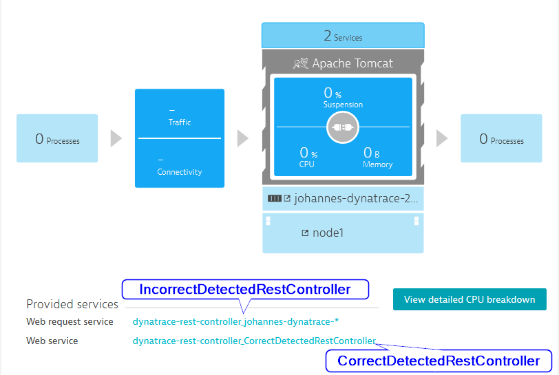
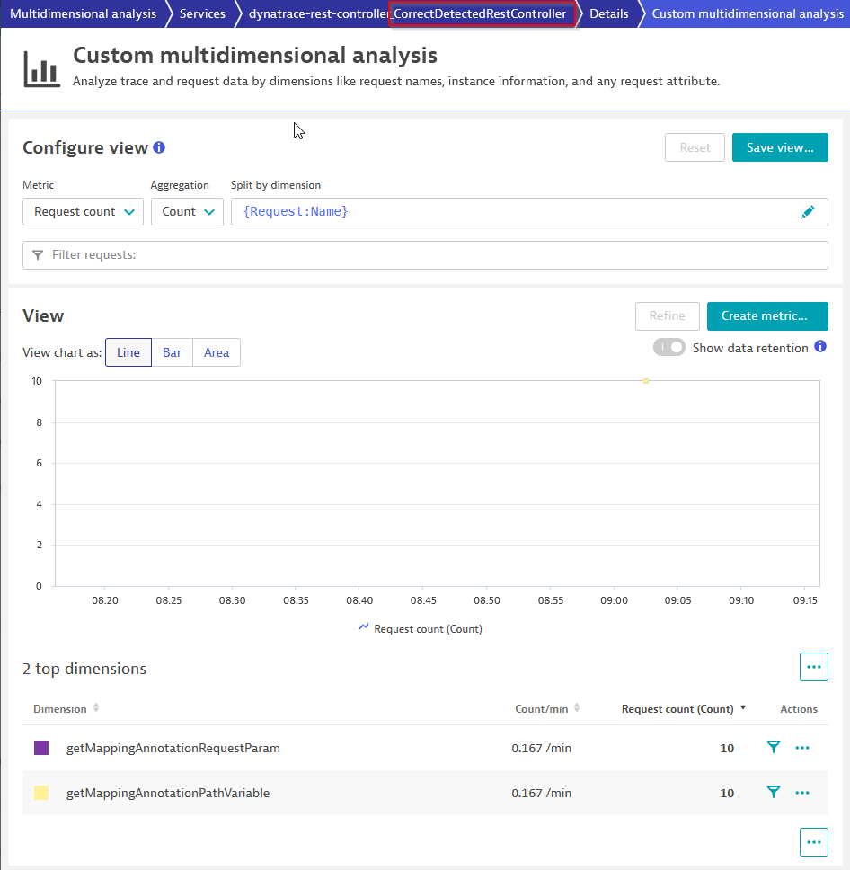
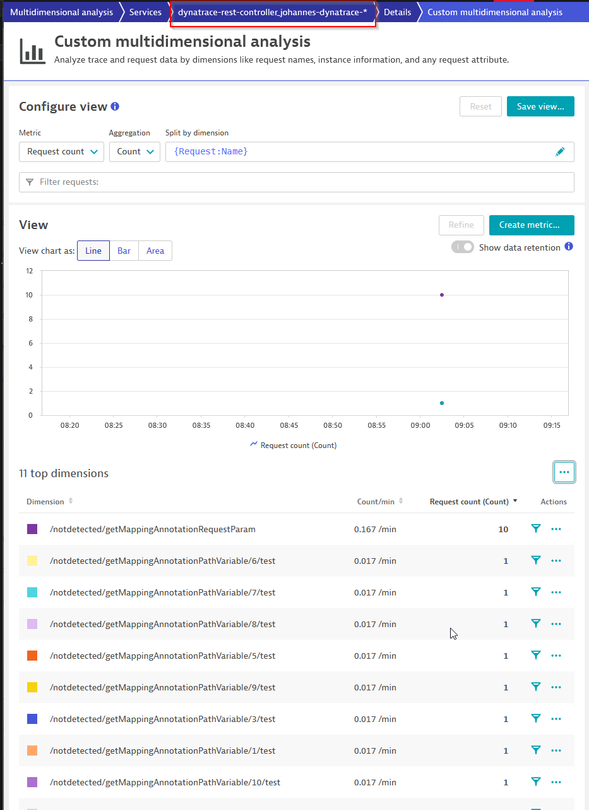

# Dynatrace Spring Rest Controller

Dynatrace does not correctly detect Spring RestControllers. OneAgent only detects and instruments RestControllers and
RequestMappings if
`@RestController` and `@RequestMapping` is used directly. Spring supports multiple options to annotate classes and
methods with these annotations.
(
see [Spring AnnotationUtils](https://github.com/spring-projects/spring-framework/blob/29d307e2113ecb16627d0ba5a6082c720f3a09c0/spring-core/src/main/java/org/springframework/core/annotation/AnnotationUtils.java#L536-L557))
Due the missing detection rules for Spring Meta-annotations, Spring RestControllers are not instrumented correctly by the Dynatrace OneAgent.

Tested with OneAgent Version: 1.285.113.20240227-120645.

## Description of example Project

The example Project contains two Spring RestController:

* com.example.correct.CorrectDetectedRestController
* com.example.incorrect.IncorrectDetectedRestController

Both contain two `GET` endpoints:

* getMappingAnnotationRequestParam: Parameter as query parameter
* getMappingAnnotationPathVariable: Parameter as path variable

As shown in the image, there are two services detected. The
service `dyntrace-rest-controller_CorrectDetectedRestController` contains requests handled
by `com.example.correct.CorrectDetectedRestController` (correctly detected as Service main technology
`Spring`).

The service `dyntrace-rest-controller_johannes-dynatrace-*` contains all requests handled
by `com.example.incorrect.IncorrectDetectedRestController`. (incorrectly detected as Service main technology
`Web request service`)

The correctly detected RestController has clear and simple naming for the two `GET` endpoints:

Requests to the incorrectly detected RestController are not merged and therfore handled as distinct requests.

## How to reproduce

Build project with maven. Copy files to a host with installed Dynatrace OneAgent. Start application and
execute `script.sh` to generate requests.
